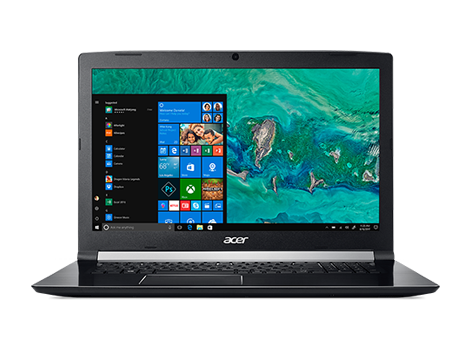
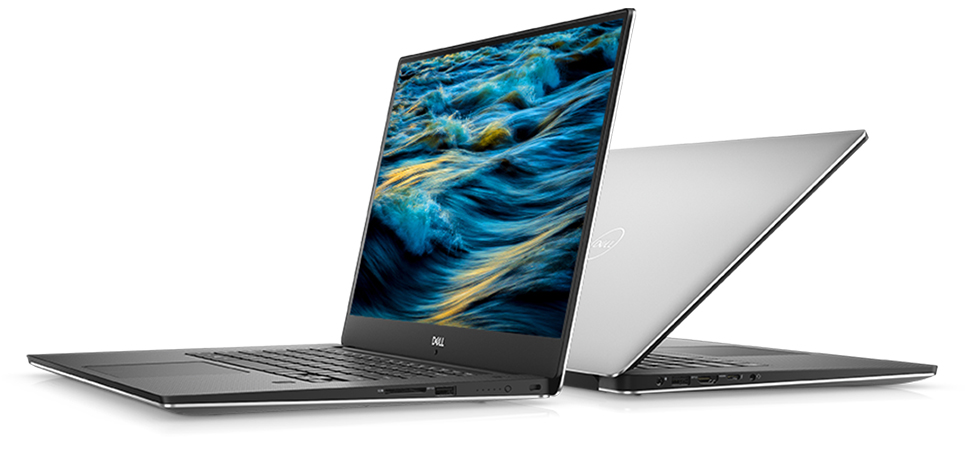
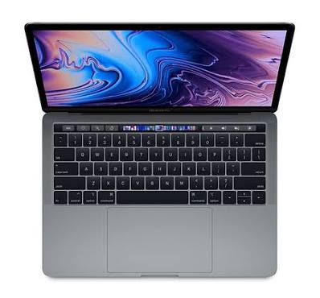
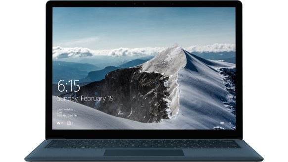

## Acer Aspire 7
***
[View Here](https://www.acer.com/ac/en/AU/content/series-design/aspire7)

**Design:** 6/10

**Touchscreen:** No

**Weight:** 2.38Kg

**Core:** Intel i7 (6 Core @ 2.2Ghz) || Intel i5 (4 Core @ 2.3Ghz)

**RAM:** 16GB (DDR4)

**Graphics:** NVIDIA GeForce GTX 1050 (4GB) || GTX 1060 (6GB)

**Storage:** 1TB HDD, 128GB SSD || 2TB HDD, 256GB SSD

**OS:** Windows 10 Home

**Screen:** 17.3" 1080p (16:9)

**Price Diff:** $300 || \$400

**Battery Life:** 6 hours (Advertised and reviewed)

## Dell XPS 15
***
[View Here](https://www.dell.com/en-au/shop/laptops-2-in-1-pcs/xps-15-9570-laptop/spd/xps-15-9570-laptop?~ck=bt)

**Design:** 10/10

**Touchscreen:** No || No || Yes

**Weight:** 2.09Kg

**Core:** Intel i5 (4 Core @ 3.6Ghz) || Intel i7 (6 Core @ 4.1Ghz)

**RAM:** 8GB (DDR4) || 8GB DDR4 || 16GB DDR4

**Graphics:** NVIDIA GeForce GTX 1050 (4GB)  || GTX 1050Ti (4GB)

**Storage:** 256GB SSD || 256GB SSD || 512GB SSD

**OS:** Windows 10 Home (64)

**Screen:** 15.6" 1080p (16:9) || 15.6" 1080p (16:9) || 15.6" 4K (16:9)

**Price Diff:** $400 || \$1000 || \$1500

**Battery Life:** 21 hours (Advertised) 9 hours on heavy use, 15 on light use (reviewed)

## Apple MacBook Pro (13 inch)
***
[View Here](https://www.apple.com/au/shop/buy-mac/macbook-pro)

**Design:** 9/10

**Touchscreen:** No

**Weight:** 1.83Kg

**Core:** Intel i5 (2 Core @ 2.3Ghz)

**RAM:** 8GB (DDR3)

**Graphics:** Intel Iris 640

**Storage:** 128GB SSD

**OS:** Mac OS X High Sierra

**Screen:** 13" 1080p (16:9)

**Price Diff:** $400

**Battery Life:** 10 hours (Advertised) 09:58 (reviewed)

## Microsoft Surface Laptop
***
[View Here](https://www.microsoft.com/en-au/p/surface-laptop/90FC23DV6SNZ/DFX6)

**Design:** 9/10

**Touchscreen:** Yes

**Weight:** 1.28Kg

**Core:** Intel i5 (2 Core @ 2.5Ghz) || Intel i7 (2 core @2.5Ghz)

**RAM:** 8GB (DDR4)

**Graphics:** Intel HD 620 || Intel Iris 640

**Storage:** 256GB SSD

**OS:** Windows 10 S Home (64) [CAN BE SWITCHED TO WINDOWS 10 HOME FOR FREE]

**Screen:** 15.6" 1080p (16:9)

**Price Diff:** \$500 || \$1000

**Battery Life:** 14:30 hours (Advertised) 8 hours solid use, 14:40 hours light video watching (reviewed)

## Apple MacBook Pro (13 inch)
***
[View Here](https://www.apple.com/au/shop/buy-mac/macbook-pro)

**Design:** 9/10

**Touchscreen:** No

**Weight:** 1.83Kg

**Core:** Intel i5 (2 Core @ 2.3Ghz)

**RAM:** 8GB (DDR3)

**Graphics:** Intel Iris 640

**Storage:** 128GB SSD

**OS:** Mac OS X High Sierra

**Screen:** 13" 1080p (16:9)

**Price Diff:** $400

**Battery Life:** 10 hours (Advertised) 09:58 (reviewed)

## Microsoft Surface Book 2
***
[View Here](https://www.microsoft.com/en-au/p/surface-laptop/90FC23DV6SNZ/DFX6)

**Design:** 9/10

**Touchscreen:** Yes

**Weight:** 1.28Kg

**Core:** Intel i5 (2 Core @ 2.5Ghz) || Intel i7 (2 core @2.5Ghz)

**RAM:** 8GB (DDR4)

**Graphics:** Intel HD 620 || Intel Iris 640

**Storage:** 256GB SSD

**OS:** Windows 10 S Home (64) [CAN BE SWITCHED TO WINDOWS 10 HOME FOR FREE]

**Screen:** 15.6" 1080p (16:9)

**Price Diff:** \$500 || \$1000

**Battery Life:** 14:30 hours (Advertised) 8 hours solid use, 14:40 hours light video watching (reviewed)
